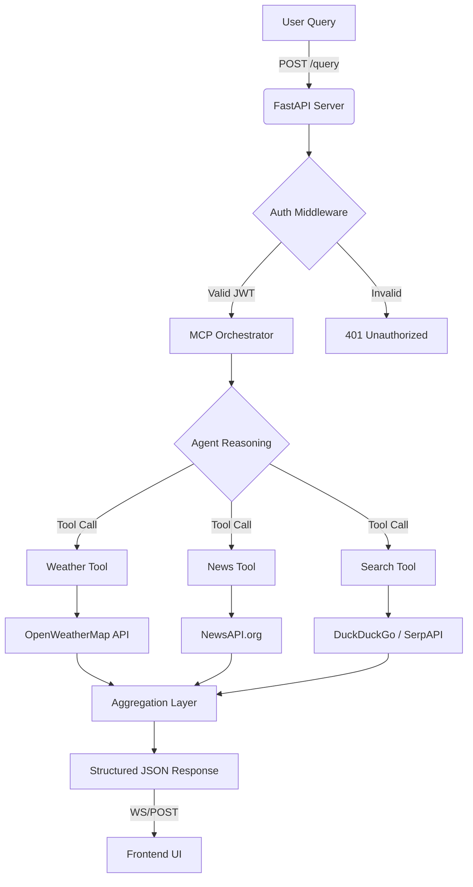
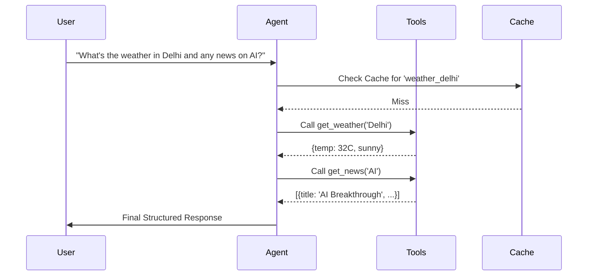

# 🎨 Design Specification: Full-Stack MCP Tool Calling App

This document provides the technical design, architectural patterns, and UI/UX specifications for the **Full-Stack MCP Tool Calling App**. It is optimized for agentic development.

---

## 🏗️ 1. High-Level Architecture

The system follows a modular architecture where the **FastAPI Backend** acts as the orchestrator between the **Modern Frontend** and the **AI Reasoning Layer (MCP)**.

### 📊 System Workflow


---

## 🔐 2. Authentication & Security

### JWT Strategy
- **Algorithm**: `HS256`
- **Payload**: `{ "sub": "user_id", "exp": timestamp }`
- **Storage**: HttpOnly Cookies (Preferred) or LocalStorage with Bearer headers.

### 🛡️ Security Callouts
> [!IMPORTANT]
> All external API keys must be stored in a `.env` file and never committed to version control.
> Sanitize all natural language inputs before passing them to the LLM context.

---

## 🧠 3. Advanced MCP & Tool Design

The agent uses **LangChain** to orchestrate tool calling. The internal reasoning follows the **ReAct (Reason + Act)** pattern.

### 🛠️ Tool Definitions
| Tool Name | Input Schema | Purpose |
| :--- | :--- | :--- |
| `get_weather` | `{"location": string}` | Fetches current weather data for a city. |
| `get_news` | `{"topic": string}` | Retrieves top headlines for a specific category or keyword. |
| `web_search` | `{"query": string}` | Performs a broad search for information not covered by specific tools. |

### 🔄 Multi-Step Reasoning Flow


---

## 🎨 4. Frontend UI/UX Design (Lush & Modern)

The UI should feel "Alive" and Premium. We will use a **Glassmorphic Dark Mode** aesthetic.

### 🌈 Color Palette
| Token | HEX | Usage |
| :--- | :--- | :--- |
| **Primary** | `#3B82F6` | Highlights, Glowing Buttons |
| **Background** | `#0F172A` | Deep Navy (Tailwind `slate-900`) |
| **Surface** | `rgba(255, 255, 255, 0.05)` | Glassmorphic Cards |
| **Accent** | `#F59E0B` | News/Alert Highlights |

### ✨ Animations & Smooth Transitions
- **Pulse Glow**: The Search button should pulse when the input is focused.
- **Staggered Fade-In**: Results (Weather cards, News items) should fade in with a 50ms stagger.
- **Sleek Loader**: A Gaussian blur background with a rotating gradient ring.

```css
/* Premium Glassmorphism */
.glass-panel {
    background: rgba(255, 255, 255, 0.03);
    backdrop-filter: blur(12px);
    border: 1px solid rgba(255, 255, 255, 0.1);
    border-radius: 16px;
    box-shadow: 0 8px 32px 0 rgba(0, 0, 0, 0.37);
}

/* Entry Animation */
@keyframes slideUp {
    from { opacity: 0; transform: translateY(20px); }
    to { opacity: 1; transform: translateY(0); }
}
.result-card {
    animation: slideUp 0.4s ease-out forwards;
}
```

---

## 📂 5. Data Models & API Contracts

### POST `/query`
**Request Body:**
```json
{
  "query": "string",
  "history": []
}
```

**Response Body (200 OK):**
```json
{
  "status": "success",
  "data": {
    "weather": { "city": "Delhi", "temp": "32°C", "condition": "Sunny" },
    "news": [ { "title": "...", "url": "..." } ],
    "search": []
  },
  "metadata": {
    "processing_time": "1.2s",
    "cached": false
  }
}
```

---

## ⚡ 6. Caching Strategy (Redis/Memory)

| Cache Key Pattern | TTL | Rationale |
| :--- | :--- | :--- |
| `weather:{city}` | 10m | Weather changes slowly. |
| `news:{topic}` | 5m | News cycles are fast. |
| `search:{query}` | 1h | General search results are stable. |

---

## 🚀 7. Implementation Roadmap (For Agent)

1.  **Phase 1: Backend Foundation**
    - Set up FastAPI with JWT middleware.
    - Implement basic health check and .env loading.
2.  **Phase 2: MCP Orchestration**
    - Integrate LangChain with Tool calling.
    - Implement the 3 core tools (Weather, News, Search).
3.  **Phase 3: Frontend Shell**
    - Build responsive HTML/Tailwind layout.
    - Implement Auth flow (Login/Signup panels).
4.  **Phase 4: State Management & UI Polish**
    - Connect `/query` endpoint with async JS.
    - Add stagger animations and glassmorphic styling.
5.  **Phase 5: Reliability**
    - Add global error boundary.
    - Implement retry logic for external APIs.

---

> [!TIP]
> Use **Vite** for the frontend setup if you need hot module replacement for a better dev experience, though vanilla HTML/JS is sufficient.
